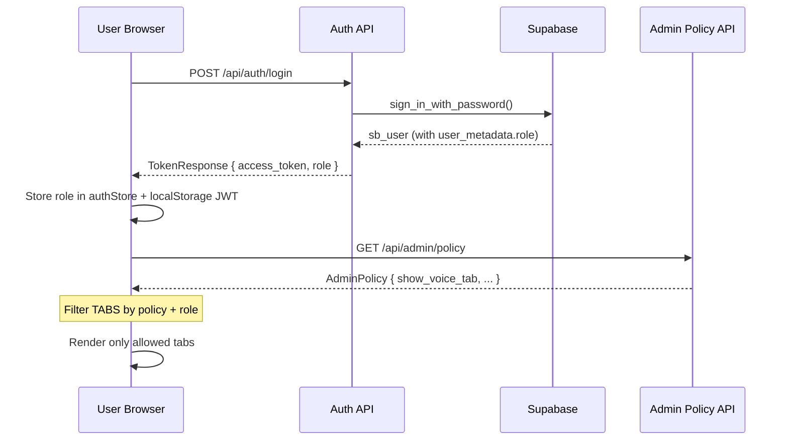

# Role-Based Login: Admin & User

## Overview

Add a two-tier role system to the ACE Voice Controller:

- **Admin** — full access to all settings tabs, can toggle which sections are visible to regular users, can manage all user accounts.  
- **User** — sees only the settings sections that the Admin has enabled for them.  

Auth is already backed by **Supabase Auth + local JWT** (no password hashing on the backend). The role field will live in Supabase's `user_metadata` and be mirrored in the backend's `settings` table for fast per-request reads.

---

## Open Questions

> [!IMPORTANT]
> **Q1 – Who creates the first Admin?**  
> Option A: The very first registered user is automatically promoted to Admin.  
> Option B: Admin is seeded via an environment variable (`ADMIN_EMAIL`).  
> *Recommendation: Option A — simplest for a single-machine desktop app.*

> [!IMPORTANT]
> **Q2 – Granularity of "visible to user" control**  
> The settings page currently has 5 tabs: **Voice Recognition, Text-to-Speech, AI Assistant, Browser Automation, System Preferences**.  
> Should the Admin control visibility at the **tab level** (hide entire tabs), or at the **individual toggle/field level**?  
> *Recommendation: Tab-level first — simpler to implement and reason about.*

> [!NOTE]
> **Q3 – Can Users change their own visible settings, or are they read-only?**  
> *Recommendation: Users can still edit the settings inside the tabs that are visible to them. Admins can lock individual tabs to read-only in a future phase.*

---

## Proposed Changes

### 1 · Backend — Role Model

---

#### [MODIFY] [models/\_\_init\_\_.py](file:///c:/Users/nithi/Desktop/Clones/voice-to-command/backend/app/models/__init__.py)

Add a `UserRole` enum and a `role` column to the `User` model. Also add an `AdminPolicy` model that stores which setting tabs an Admin has enabled for regular users.

```python
# New enum
class UserRole(str, enum.Enum):
    admin = "admin"
    user  = "user"

# Add to User model:
role: Mapped[str] = mapped_column(
    SAEnum(UserRole), default=UserRole.user, nullable=False
)

# New table
class AdminPolicy(Base):
    """Controls which settings tabs are visible to non-admin users."""
    __tablename__ = "admin_policy"

    id: Mapped[str] = mapped_column(Uuid(as_uuid=False), primary_key=True, default=new_uuid)
    # Tab visibility (True = visible to User role)
    show_voice_tab:   Mapped[bool] = mapped_column(Boolean, default=True)
    show_tts_tab:     Mapped[bool] = mapped_column(Boolean, default=True)
    show_ai_tab:      Mapped[bool] = mapped_column(Boolean, default=False)   # hidden by default
    show_browser_tab: Mapped[bool] = mapped_column(Boolean, default=True)
    show_system_tab:  Mapped[bool] = mapped_column(Boolean, default=False)   # hidden by default
    updated_at: Mapped[datetime] = mapped_column(DateTime(timezone=True), default=utcnow, onupdate=utcnow)
```

> [!NOTE]
> `AdminPolicy` is a singleton table (one row per installation). The Admin panel will upsert this single row.

---

#### [MODIFY] [core/security.py](file:///c:/Users/nithi/Desktop/Clones/voice-to-command/backend/app/core/security.py)

Embed `role` in the JWT payload at login/register so the frontend can read it without an extra round-trip.

```python
# create_access_token now accepts role:
def create_access_token(data: dict[str, Any], ...) -> str:
    # data already contains "sub", "email", and now "role"
    ...
```

---

#### [MODIFY] [routers/auth.py](file:///c:/Users/nithi/Desktop/Clones/voice-to-command/backend/app/routers/auth.py)

1. On **register**: check if this is the first user ever → if yes, set `role = admin` in Supabase `user_metadata`; otherwise `role = user`.
2. On **login / sync**: read `role` from Supabase `user_metadata`, include in JWT.
3. Return `role` in `TokenResponse`.

```python
# New logic in register():
user_count = supabase_admin.table("settings").select("id", count="exact").execute()
is_first_user = (user_count.count == 0)
role = "admin" if is_first_user else "user"

# Sign up with role in metadata:
supabase.auth.sign_up({
    "email": ..., "password": ...,
    "options": {"data": {"display_name": ..., "role": role}}
})

# In login() and sync(): extract role from sb_user.user_metadata
role = (sb_user.user_metadata or {}).get("role", "user")
token = create_access_token({"sub": ..., "email": ..., "role": role})
```

---

#### [MODIFY] [schemas/\_\_init\_\_.py](file:///c:/Users/nithi/Desktop/Clones/voice-to-command/backend/app/schemas/__init__.py)

Add `role` to `TokenResponse` and new schemas for admin policy.

```python
class TokenResponse(BaseModel):
    access_token: str
    user_id: str
    email: str
    role: str  # "admin" | "user"  ← NEW

class AdminPolicyResponse(BaseModel):
    show_voice_tab:   bool
    show_tts_tab:     bool
    show_ai_tab:      bool
    show_browser_tab: bool
    show_system_tab:  bool

class AdminPolicyUpdate(BaseModel):
    show_voice_tab:   bool | None = None
    show_tts_tab:     bool | None = None
    show_ai_tab:      bool | None = None
    show_browser_tab: bool | None = None
    show_system_tab:  bool | None = None
```

---

### 2 · Backend — Admin Policy Router

---

#### [NEW] [routers/admin\_router.py](file:///c:/Users/nithi/Desktop/Clones/voice-to-command/backend/app/routers/admin_router.py)

A new router mounted at `/api/admin` with two endpoints:

| Method | Path | Description |
|--------|------|-------------|
| `GET` | `/api/admin/policy` | Returns the current tab-visibility policy (any authenticated user can read — used by User to know what to show) |
| `PATCH` | `/api/admin/policy` | Update the policy — **Admin only** |
| `GET` | `/api/admin/users` | List all users with their roles — **Admin only** |
| `PATCH` | `/api/admin/users/{user_id}/role` | Promote/demote a user — **Admin only** |

**Admin guard dependency:**
```python
async def require_admin(
    credentials: HTTPAuthorizationCredentials = Depends(_bearer),
) -> str:
    payload = decode_access_token(credentials.credentials)
    if payload.get("role") != "admin":
        raise HTTPException(status_code=403, detail="Admin access required")
    return payload["sub"]
```

---

#### [MODIFY] [main.py](file:///c:/Users/nithi/Desktop/Clones/voice-to-command/backend/app/main.py)

Register the new router:
```python
app.include_router(admin_router.router, prefix="/api/admin", tags=["Admin"])
```

---

### 3 · Database Migration

---

#### [NEW] [migrate\_role.py](file:///c:/Users/nithi/Desktop/Clones/voice-to-command/backend/migrate_role.py)

A standalone migration script (run once) that:
1. Adds `role` column (`text`, default `'user'`) to the `users` table via Supabase SQL.
2. Creates the `admin_policy` table with its default row.
3. Sets the first registered user to `role = 'admin'` in `user_metadata`.

```
python migrate_role.py
```

> [!WARNING]
> This migration must be run before deploying the new backend. Supabase RLS policies may need updating to expose the `admin_policy` table.

---

### 4 · Frontend — Auth Store

---

#### [MODIFY] [store/authStore.ts](file:///c:/Users/nithi/Desktop/Clones/voice-to-command/frontend/src/store/authStore.ts)

Add `role` to the store state and extract it from the local JWT after sync.

```typescript
interface AuthState {
  session: Session | null;
  user: User | null;
  role: "admin" | "user" | null;  // ← NEW
  loading: boolean;
  isAdmin: () => boolean;          // ← helper
  ...
}

// After syncWithBackend resolves:
const token = localStorage.getItem("ace-local-token");
if (token) {
  const payload = JSON.parse(atob(token.split(".")[1]));
  set({ role: payload.role ?? "user" });
}
```

---

### 5 · Frontend — Admin Policy Hook

---

#### [NEW] [hooks/useAdminPolicy.ts](file:///c:/Users/nithi/Desktop/Clones/voice-to-command/frontend/src/hooks/useAdminPolicy.ts)

Fetches the tab visibility policy from `/api/admin/policy` and caches it.

```typescript
export interface AdminPolicy {
  show_voice_tab:   boolean;
  show_tts_tab:     boolean;
  show_ai_tab:      boolean;
  show_browser_tab: boolean;
  show_system_tab:  boolean;
}

export function useAdminPolicy(): AdminPolicy {
  // fetches once on mount, returns defaults (all true) while loading
}
```

---

### 6 · Frontend — Settings Page (RBAC-Aware)

---

#### [MODIFY] [app/settings/page.tsx](file:///c:/Users/nithi/Desktop/Clones/voice-to-command/frontend/src/app/settings/page.tsx)

The 5-tab `TABS` array is filtered based on the user's role and the Admin policy:

```tsx
const { role } = useAuthStore();
const policy = useAdminPolicy();
const isAdmin = role === "admin";

const TABS = [
  { id: "voice",   label: "Voice Recognition",  icon: Mic,    visible: isAdmin || policy.show_voice_tab },
  { id: "tts",     label: "Text-to-Speech",      icon: Volume2, visible: isAdmin || policy.show_tts_tab },
  { id: "ai",      label: "AI Assistant",        icon: Bot,    visible: isAdmin || policy.show_ai_tab },
  { id: "browser", label: "Browser Automation",  icon: Globe,  visible: isAdmin || policy.show_browser_tab },
  { id: "system",  label: "System Preferences",  icon: Shield, visible: isAdmin || policy.show_system_tab },
].filter(t => t.visible);
```

---

### 7 · Frontend — Admin Panel Page

---

#### [NEW] [app/admin/page.tsx](file:///c:/Users/nithi/Desktop/Clones/voice-to-command/frontend/src/app/admin/page.tsx)

A new page only accessible when `role === "admin"`. Contains two sections:

**Section A — Settings Visibility Control**

A grid of toggles, one per settings tab:

| Tab | Visible to Users |
|-----|-----------------|
| Voice Recognition | ✅ Toggle |
| Text-to-Speech | ✅ Toggle |
| AI Assistant | ✅ Toggle |
| Browser Automation | ✅ Toggle |
| System Preferences | ✅ Toggle |

Saves via `PATCH /api/admin/policy`.

**Section B — User Management**

A table listing all registered users with:
- Email, Display Name, Role badge (`admin` / `user`)
- A "Promote to Admin" / "Demote to User" button per row

Saves via `PATCH /api/admin/users/{user_id}/role`.

---

### 8 · Frontend — Sidebar & Route Guard

---

#### [MODIFY] [components/layout/Sidebar.tsx](file:///c:/Users/nithi/Desktop/Clones/voice-to-command/frontend/src/components/layout)

Add an **Admin Panel** link in the sidebar that is only rendered when `isAdmin === true`.

```tsx
{isAdmin && (
  <SidebarLink href="/admin" icon={ShieldCheck} label="Admin Panel" />
)}
```

#### [NEW] Route Guard Component

```tsx
// components/auth/AdminGuard.tsx
// Redirects to "/" if role !== "admin"
export function AdminGuard({ children }) {
  const { role, loading } = useAuthStore();
  if (loading) return <Spinner />;
  if (role !== "admin") { redirect("/"); return null; }
  return <>{children}</>;
}

// Used in app/admin/layout.tsx:
export default function AdminLayout({ children }) {
  return <AdminGuard>{children}</AdminGuard>;
}
```

---

## Data Flow Diagram



---

## Verification Plan

### Automated Tests
```bash
# Backend: run existing pytest suite after migration
cd backend && venv\Scripts\python.exe -m pytest tests/ -v

# Test the new admin endpoints with a tool like HTTPie or curl:
# 1. Login as admin → get token with role="admin"
# 2. PATCH /api/admin/policy with token → 200
# 3. Login as user → get token with role="user"  
# 4. PATCH /api/admin/policy with user token → 403
```

### Manual Verification
1. Register the **first** user → confirm role badge shows **Admin** in profile/sidebar
2. Register a **second** user → confirm role badge shows **User**
3. As Admin, open **Admin Panel → Settings Visibility** → toggle off **AI Assistant** tab → save
4. Log in as User → confirm **AI Assistant** tab is not visible in Settings
5. As Admin, re-enable the tab → log in as User → confirm it reappears
6. As Admin, promote the second user → confirm they gain Admin Panel access
